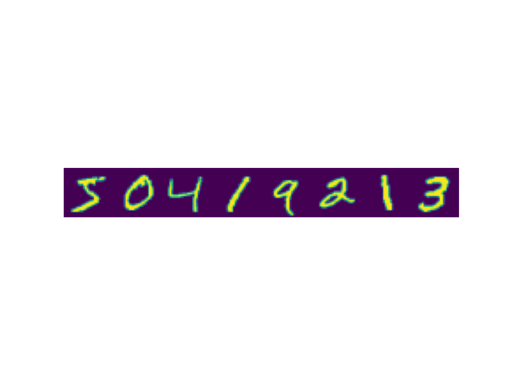

### Convolutional Neural network Exercise

### Task 1 - Find Waldo
In this first task use cross-correlation to find Waldo in the image below:

[ Image source: https://rare-gallery.com ]

Recall that cross-correlation, which the machine learning world often refers to as convolution is defined as:

$$ S(i,j) = (\mathbf{K}*\mathbf{I}) = \sum_m^M \sum_n^N \mathbf{I}(i+m, j+n)\mathbf{K}(m,n). $$

for an image matrix I and a kernel matrix $K$ of shape $(M \times N)$. To find waldo use the waldo-kernel below:

#### Task 1.1 - Direct convolution
Navigate to the `src/custom_conv.py` module.
- Start in `my_conv_direct` and implement the convolution following the equation above. Test your function with vscode tests or `nox -s test`.
- Go to `src/waldo.py` and make sure that `my_conv_direct` is used for convolution. This script finds waldo in the image using your convolution function. Execute it with `python ./src/waldo.py` in your terminal.
- If your code passes the pytest but is too slow to find waldo feel free to use `scipy.signal.correlate2d` in `src/waldo.py` instead of your convolution function.

#### Task 1.2 (Optional)
Navigate to the `src/custom_conv.py` module.
The function `my_conv` implements a fast version of the convolution operation above using a flattend kernel. We learned about this fast version in the lecture. Have a look at the slides again and then implement `get_indices` to make `my_conv` work. It should return
- A matrix of indices following the flattend convolution rule from the lecture, e.g. for a $(2\times 2)$ kernel and a $(3\times 3)$ image it should return the index transformation

$$
   \begin{pmatrix}
   0 & 1 & 2 \\
   3 & 4 & 5 \\
   6 & 7 & 8 \\
   \end{pmatrix}
   \rightarrow
   \begin{pmatrix}
   0 & 1 & 3 & 4 \\
   1 & 2 & 4 & 5 \\
   3 & 4 & 6 & 7 \\
   4 & 5 & 7 & 8
   \end{pmatrix}  $$

- The number of rows and columns in the result following
   $$o=(i-k)+1$$
   where $i$ denotes the input size and $k$ the kernel size.

You can test the function with `nox -s test` by importing `my_conv` in `tests/test_conv.py` and changing `my_conv_direct` to `my_conv` in the test function. Make sure that `src/waldo.py` now uses `my_conv` for convolution and run the script again.

### Task 2 - MNIST - Digit recognition

Open `src/mnist.py` and implement MNIST digit recognition with `CNN` in `torch`

- *Reuse* your code from yesterday.
- Reuse yesterday's `Net` class, add convolutional layers and pooling. `torch.nn.Conv2d` and `torch.nn.MaxPool2d` will help you.
